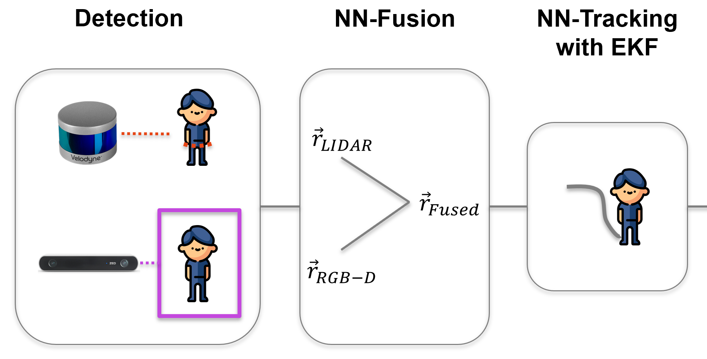
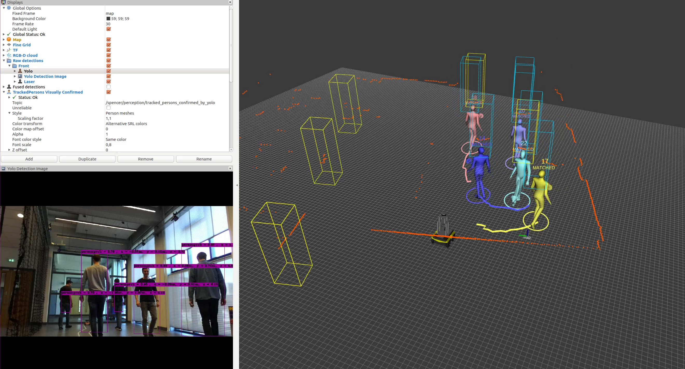

# Spencer People Tracker with YOLO
This package extends the existing Spencer People Tracker with a data-driven, RGB-D based pedestrian detector. For this purpose, the [YOLO object detector](https://pjreddie.com/darknet/yolo/) is used. Using the ZED stereo camera from Stereolabs, YOLO detects pedestrians in an RGB image. The ZED-YOLO wrapper then computes the pedestrian's position in 3D space using the camera's pointcloud. 
The Spencer People Tracker already provides RGB-D based pedestrian detectors. With YOLO, however, pedestrians can be detected more reliably. 
The YOLO detector has been integrated into the Spencer People Tracking package as an additional pedestrian detector. The other detectors can still be used if one wishes to do so. 

- **YOLOv3 object detector for RGB based pedestrian detection:** Instead of the upper body detector, one can use YOLOv3 for pedestrian detection, in combination with the package available at https://github.com/PhiAbs/zed-yolo and the ZED stereo camera. The different detectors can be turned on or off in the jackal_tracking.launch file.
- **Realsense data type converter:** The depth image coming from the realsense d435 camera had a wrong format. The file from https://gist.github.com/tim-fan/a2abe1fe15cce8111d06c5c2187c7e97 was included in a new package which allows to use the realsense camera together with the upper body detector.
- **Static laser calibration:** The laser detections had an offset in x direction (away from the robot). The package static_calibration subtracts this offset. 
- **Providing information for data driven trajectory prediction:** The package trajectory_prediction publishes information on some ROS topics that can be used for data driven trajectory prediction.

The complete Pipeline looks as follows: 

</img>

More information about the Spencer People Tracking pipeline can be found [here](spencer_people_tracking/README.md)

## Results

</img>

## Sensor Requirements
This package has been tested with the following Sensors:
- [Velodyne VLP16 LIDAR](https://velodynelidar.com/vlp-16.html)
- [Stereolabs ZED Stereo camera](https://www.stereolabs.com/zed/)

## Software Requirements
- Ubuntu 16.04
- Cuda 9.0
- cuDNN 7.6
- [ZED SDK for Ubuntu 16.04 and CUDA 9.0](https://www.stereolabs.com/developers/release/#sdkdownloads_anchor)
- ROS Kinetic
- OpenCV 2.4 (follow [this](https://gist.github.com/sedovolosiy/6711123a9e5a73a6ce519e80338d0067) guide. Careful: it might be that for the cmake command, you have to add -D WITH_CUDA=OFF)

## Installation
Create Catkin workspace, clone the repo and install dependencies:

    sudo apt-get install python-catkin-tools
    mkdir -p catkin-ws/src
    cd catkin-ws
    catkin config --init --cmake-args -DCMAKE_BUILD_TYPE=RelWithDebInfo
    cd src
    git clone https://github.com/PhiAbs/spencer_people_tracking_yolo.git
    rosdep update
    rosdep install -r --from-paths . --ignore-src
    sudo apt-get install libsvm-dev

Compile Darknet: A fork from @AlexeyAB is [used](https://github.com/AlexeyAB/darknet)

    cd spencer_people_tracking_yolo/zed-yolo/libdarknet
    make -j4

Build the ROS packages

    cd catkin_ws
    catkin build -c -s
    source devel/setup.bash

## Weight files
There are two different weight files one can use. The lightweight YOLOv3 model is able to run at around 18 FPS on an nvidia jetson agx xavier board. The heavier YOLOv3 model is slower but has a slightly better detection accuracy. It is recommended to use the lightweight model. 

Download them from [here](https://pjreddie.com/darknet/yolo/)
and place them in here:

    spencer_people_tracking_yolo/zed-yolo/libdarknet/weights

## Running the Detection-Tracking-Pipeline 

### Launch the YOLO Pedestrian detection module
There are two different launch files available, one for either of the two weight files:

lighweight model:
    
    roslaunch yolo_pedestrian_detector pedestrian_detector_tiny.launch

normal model:

    roslaunch yolo_pedestrian_detector pedestrian_detector.launch

### Launch the Spencer people tracking pipeline
roslaunch spencer_people_tracking_launch jackal_tracking.launch

